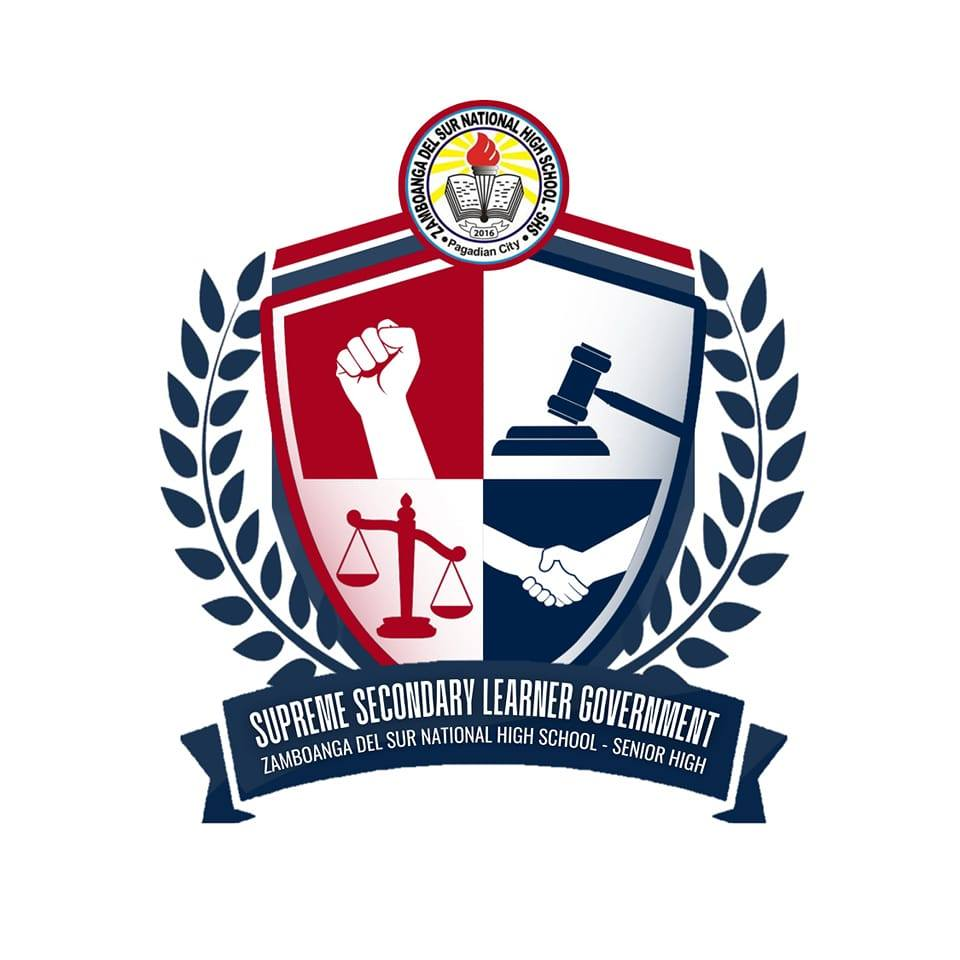

# 🌐 ICT Club Website – ZSNHS-SHS

Welcome to the official repository of the **ICT Club Website** for **Zamboanga del Sur National High School – Senior High School (ZSNHS-SHS)**.  
This is the **digital home of the ICT Club**, showcasing our **events, officers, activities, and goals**—a hub for **students, teachers, and the community** to connect with us. 🎓💻

---


## Table of Contents
- [Official Logos](#-official-logos)
- [About the Project](#-about-the-project)
- [Tech Stack](#-tech-stack)
- [Project Structure](#-project-structure)
- [Acknowledgements](#-acknowledgements)
- [License](#-license)
- [Star History](#-starhistory)

---

## 🖼️ Official Logos
| ICT Club | ZSNHS-SHS | SSLG |
|---|---|---|
|  |  |  |

---

## 📖 About the Project
The ICT Club Website is designed to:
- Highlight **events and activities** (Esports, workshops, tech talks)
- Showcase our **vision, mission, and goals**
- Introduce the **club officers and advisers**
- Provide ways to **contact and connect** with us
- Inspire **collaboration, creativity, and innovation** in ICT

---

## 🛠️ Tech Stack
- **HTML5** – semantic, accessible structure  
- **SCSS (Dart Sass)** – modular, maintainable styles  
- **Vanilla JavaScript** – interactivity and DOM logic  
- **GitHub Pages / Vercel** – simple, fast deployment  

---

## 📂 Project Structure
```plaintext
kevclint-zsnhs-shs-ict-club/
├── README.md
├── index.html
├── LICENSE
├── assets/
│   └── favicon_io/
│       └── site.webmanifest
├── pages/
│   ├── clubevent/
│   │   ├── event.html
│   │   ├── src/
│   │   │   └── image-click.js
│   │   └── styles/
│   │       ├── style.css
│   │       └── style.scss
│   ├── contact/
│   │   ├── contact.html
│   │   └── styles/
│   │       ├── style.css
│   │       └── style.scss
│   └── officers-teachers/
│       ├── officers.html
│       ├── teachers.html
│       └── styles/
│           ├── style.css
│           └── style.scss
├── src/
│   ├── header-transition.js
│   ├── script.js
│   └── ReuseHeaderFooter/
│       ├── footer.html
│       ├── header.html
│       └── load-header-footer.js
└── styles/
    ├── base/
    │   ├── style.css
    │   └── style.scss
    ├── components/
    │   ├── _about.scss
    │   ├── _event.scss
    │   ├── _footer.scss
    │   ├── _getintouch.scss
    │   ├── _header.scss
    │   ├── _hero.scss
    │   └── _officers-teachers.scss
    └── utils/
        └── _root.scss
```
---
## 🙌 Acknowledgements  

This project would not have been possible without the support and contributions of many individuals and groups.  

- **Zamboanga del Sur National High School – Senior High School (ZSNHS-SHS)**  
  For providing the platform, encouragement, and continuous support in ICT initiatives.  

- **ICT Club Officers and Advisers**  
  For their leadership, guidance, and dedication in making this project a success.  

- **SSLG (Supreme Secondary Learner Government)**  
  For collaborating and supporting activities that empower student voices and initiatives.  

- **ICT Club Members & Student Volunteers**  
  For contributing their time, creativity, and ideas to design and improve the website.  

- **Teachers, Mentors, and the School Community**  
  For inspiring collaboration, innovation, and responsible use of technology.  

💡 *Special thanks to everyone who believes in the power of ICT to connect, inspire, and create opportunities for students.*  

---
## 📜 License
This project is licensed under the MIT License.

---
## Star History

[](https://www.star-history.com/#KevClint/ZSNHS-SHS-ICT-CLUB&Date)


